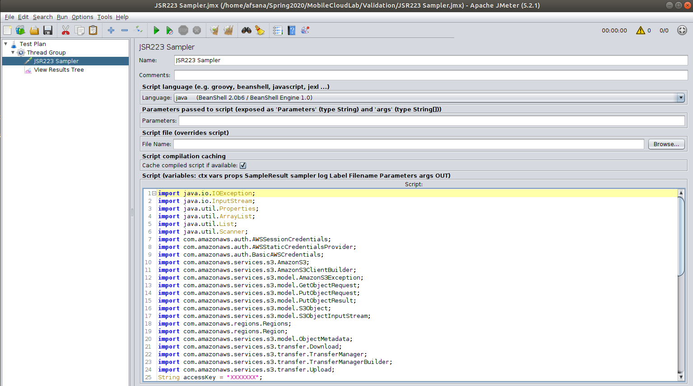
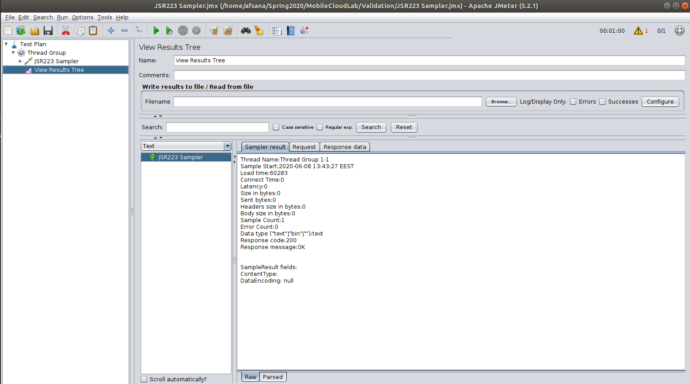

# Data-pipeline-Validation-And-Load-Testing-with-Multiple-images
TOSCA Data pipeline to generate thumbnail of images in S3 bucket using Amazon lambda function. Push thumbnail to S3 bucket.  

**Short Description**: Deploying pipelines on multiple Openstack instances that would read, preprocess, and store the image files.  

**Long Description**: 
This data pipeline (DP) implementation can be visualized with below figure. Upon deployment of the DP, _Pipeline1_ will get the list of images present in one AWS S3 bucket (_AWS S3 bucket1_) followed by downloading the images to _Instance-1_. The images will be sent to another instance _Instance-2_. _Pipeline2_ on _Instance-2_ will be responsible for invoking lambda function to process the received images. Further, _Pipeline3_ will be responsible for pushing the processed images to another S3 bucket (_AWS S3 bucket2_).  

In doing so, no data is stored in another instance. The images in _AWS S3 bucket1_ will not be deleted.


The *service.yml* template file will have the following tasks:
- Create two instances in openstack environment with Centos atop.
- Install and configure Apache Nifi on both instances
- Deploying and configuring *Pipelines3* atop Nifi on *Instance-2*.
- Deploying and configuring *Pipelines2* atop Nifi on *Instance-2*.
- Deploying and configuring *Pipelines1* atop Nifi on *Instance-1*.

## Preparing the Environment

## 1. Build the lambda function
- `mkdir lambdaFun`
- `cd lambdaFun`
- Download suitable PIL wheel file from [here](https://pypi.org/project/Pillow/#files "here"). This is for the supporting library for resizing the image that we will use in our python script.
- Extract the wheel file and remove the zip file from the current location.
- Write the python code to resize the image (given below). Save the code in `imgResize.py` file.  

**imgResize.py** [\[link to download\]](https://github.com/radon-h2020/lambda-thumbGen-TOSCA-datapipeline/blob/master/LambdaFunction/imgResize.py)
```python
import PIL
from PIL import Image
import base64


def write_to_file(save_path, data):
  with open(save_path, "wb") as f:
    f.write(base64.b64decode(data))


def lambda_handler(event, context):    
    # get the image from the "body" which is encoded in some format and is in the HTTP request itself.
    write_to_file("/tmp/photo.jpg", event["body"])
    
    size = 64, 64 # size of thumbnail img
    print("Open the image from /tmp/ dir")
    img = Image.open('/tmp/photo.jpg')
    print("Creating the thumbnail")
    img.thumbnail(size)
    print("Saving the thumbnail")
    img.save( "/tmp/photo_thumbnail.jpg", "JPEG")


    # open again for encoding
    with open("/tmp/photo_thumbnail.jpg", "rb") as imageFile:
      str = base64.b64encode(imageFile.read())
      encoded_img = str.decode("utf-8")

    print("Print the encoded image:")
    print(encoded_img)
    print("# Now return the encoded img.\n")

    return {
      "isBase64Encoded": True,
      "statusCode": 200,
      "headers": { "content-type": "image/jpeg"},
      "body": encoded_img
    }
```

- Make sure that the current directory contains only the python file and the supporting libraries. 
- Make a ZIP including own python file and the PIL library
    `zip -r9 code.zip .`  

Download the zip [here](https://github.com/radon-h2020/lambda-thumbGen-TOSCA-datapipeline/blob/master/LambdaFunction/thumbGenLambda.zip) and ignore above steps or some unexpected errors

## 2. Upload the function
- Create a lambda function called `imgResizer`.
- Upload `code.zip` to that function.
- Note down “`function name`” and “`region`”

## 3. Create two S3 buckets
- First bucket name: “`radon-utr-thumbgen`”. This is for keeping the original images.
- Second bucket name: “`radon-utr-thumbgen-resized`”. This is for storing the thumbnails.
- Note down the region names of those buckets.
- Upload some `.jpg` images.

# Prerequisites
This demo uses 
- Openstack environment for creating instances
   - we may refer the steps [here](https://github.com/radon-h2020/xopera-opera) to setup OpenStack client.
- Apache Nifi v1.11.1 for pipeline base
- xOpera release 0.5.2 [Download here](https://github.com/radon-h2020/xopera-opera/releases/tag/0.5.2 "Download here").
- TOSCA Simple Profile in YAML Version 1.3 [link](https://docs.oasis-open.org/tosca/TOSCA-Simple-Profile-YAML/v1.3/TOSCA-Simple-Profile-YAML-v1.3.html)

## Assumptions:
- Openstack environment is ready and you are able to login and create instances through CLI.
- Lambda function is uploaded and tested.
- Two S3 buckets are created.
- Source codes are downloaded in placed in proper place.
## Source code modification:
- In `service.yml`:
	- Update the `template_file`, `cred_file_path`, and `file` under `pipeline3_pushImg`, `pipeline2_invokeLmabda`, and `pipeline1_getS3Img` nodes. 
	- Update `key_name` under `vmone` and `vmtwo` nodes
	- Update *properties values* under `vmone` and `vmtwo` nodes, if required.
- In `credentials file`: 
	- Update the access key and secret key to invoke AWS services
	- Update the template file path mentioned in the pipeline nodes.


# Execution:
- Setup the virtual environment
- Connect to openstack environment
- Execute the following command
`Opera deploy service.yml`


# Validation of the Data Pipelines

# Prerequisites
- Java9
- Apache Jmeter
- aws-java-sdk-s3 JAR 1.11.313 dependencies [jar files](https://jar-download.com/artifacts/com.amazonaws/aws-java-sdk-s3/1.11.313/source-code)

# Upload Images to First AWS S3 Bucket using Apache Jmeter
- Copy the jar files to JMeterHome/lib/ext/ of Jmeter.
- Create a Test Plan and click on Thread Group.
- Set Number of Threads, Ramp-up period and Loop Count to 1.
- Right click on thread groups and as a JSR233 sampler.
- Select Java as the language in the JSR233 sampler.
- Add the following code in the script section of the sampler.
```
import java.io.IOException;
import java.io.InputStream;
import java.util.Properties;
import java.util.ArrayList;
import java.util.List;
import java.util.Scanner;
import com.amazonaws.auth.AWSSessionCredentials;
import com.amazonaws.auth.AWSStaticCredentialsProvider;
import com.amazonaws.auth.BasicAWSCredentials;
import com.amazonaws.services.s3.AmazonS3;
import com.amazonaws.services.s3.AmazonS3ClientBuilder;
import com.amazonaws.services.s3.model.AmazonS3Exception;
import com.amazonaws.services.s3.model.GetObjectRequest;
import com.amazonaws.services.s3.model.PutObjectRequest;
import com.amazonaws.services.s3.model.PutObjectResult;
import com.amazonaws.services.s3.model.S3Object;
import com.amazonaws.services.s3.model.S3ObjectInputStream;
import com.amazonaws.regions.Regions;
import com.amazonaws.regions.Region;
import com.amazonaws.services.s3.model.ObjectMetadata;
import com.amazonaws.services.s3.transfer.Download;
import com.amazonaws.services.s3.transfer.TransferManager;
import com.amazonaws.services.s3.transfer.TransferManagerBuilder;
import com.amazonaws.services.s3.transfer.Upload;

String accessKey = "xxxxxxx";
String secretKey = "xxxxxxxxx";               
String bucketName = "radon-utr-thumbgen1"; //specify bucketname
String region = "eu-north-1";

BasicAWSCredentials sessionCredentials = new BasicAWSCredentials(accessKey, secretKey);

AmazonS3 s3 = AmazonS3ClientBuilder.standard()
   .withRegion(region)
   .withCredentials(new AWSStaticCredentialsProvider(sessionCredentials))
   .build();
   
TransferManager xfer_mgr = TransferManagerBuilder.standard()
   .withS3Client(s3)
               .withDisableParallelDownloads(false)
               .build();


ArrayList list = new ArrayList();  
Scanner s = new Scanner(new File("/home/afsana/Spring2020/MobileCloudLab/Validation/dt25.txt")); //path to txt file
while (s.hasNextLine()){
    list.add(s.nextLine());
    
}
s.close();   
for (int i = 0; i < list.size();i++) 
{ 		      
	
	File f = new File(list.get(i));
	String obj = 	objectName + Integer.toString(i); 
	Upload xfer = xfer_mgr.upload(bucketName, obj, f);	
	xfer.waitForCompletion();

	
}   
xfer_mgr.shutdownNow();


```
- The accessKey and secretKey of the AWS account needs to be specified in the java code. 
- The bucketName and region of the S3 bucket should be set in the code.
- Right click on thread groups and add a listener “View Results Tree” which will be used to check if the uploading is done successfully.
- Click on the Run option and look into the view results tree Listener. The Load time can be found here.


- For testing purposes the Holidays dataset has been used which has a total of 1491 images. The testing is done with first 25 images, next 50 images and then next 100 images of the dataset.
- The python script in filepath.py is used to get the file paths of the images stored in the image folder.
```
import os
import csv
def ls(path):
   all = [ ]
   walked = os.walk(path)
   for base, sub_f, files in walked:           
       for sub in sub_f:           
            entry = os.path.join(base,sub)
            entry = entry[len(path):].strip("\\")
            all.append(entry)

       for file in files:          
           entry = os.path.join(base,file)
           entry = entry[len(path):].strip("\\")
           all.append(entry)
   all.sort()
   return all


folder = "/home/afsana/Spring2020/MobileCloudLab/Validation/dataset/minidatasets/dt-25/"
arr = ls(folder)
paths = []
for i in arr:
    p = folder+i
    paths.append(p)

f=open('dt100.txt','w')
for ele in paths:
    f.write(ele+'\n')

f.close()

```
- The path to the image folder is to be specified in the python script. The script creates a .txt file which contains file paths of all the images which are later used for uploading to the S3 bucket via Jmeter. The path to the .txt file is specified in the Java code of JSR233 sampler of Jmeter.

# Monitoring Apache Nifi Metrics Using PrometheusReportingTask

## Prometheus

Prometheus is an open source monitoring and alerting toolkit for containers and microservices. The toolkit is highly customizable and designed to deliver rich metrics without creating a drag on system performance. Prometheus has become the mainstream, open source monitoring tool of choice for those that lean heavily on containers and microservices.

## Prometheus Pushgateway

The Prometheus Pushgateway exists to allow ephemeral and batch jobs to expose their metrics to Prometheus. Since these kinds of jobs may not exist long enough to be scrapped, they can instead push their metrics to a Pushgateway. The Pushgateway then exposes these metrics to Prometheus.

## PrometheusReportingTask

The PrometheusReportingTask is a reporting task in Nifi which is capable of sending monitoring statistics as prometheus metrics to a prometheus pushgateway. Further, the Prometheus server scrapes the metrics from the pushgateway. The documentation is provided here. Based on the metrics retrieved from the PrometheusReportingTask, autoscaling in the nifi instance can be done.

## Steps to Monitor Apache Nifi Instance using PrometheusReportingTask

- Open Nifi Instance at http://<ip>:8080/nifi and go to the menu in the upper right:
.
